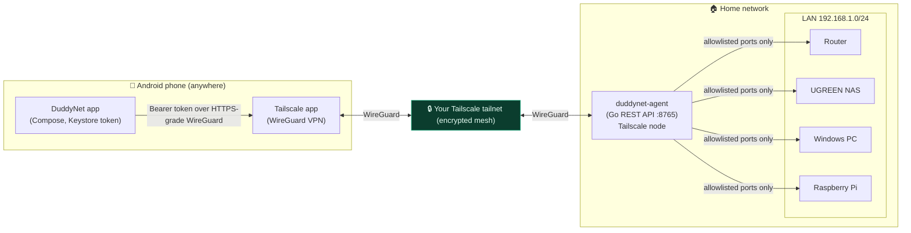

# DuddyNet

**Secure remote access to your home network from your Android phone — over
Tailscale, with no exposed ports.**

DuddyNet lets you check on and manage selected devices and services on your home
LAN while you're away: see if the NAS/router/PC are up, run health checks, wake a
sleeping PC with Wake-on-LAN, and open admin pages in your browser — all across an
encrypted Tailscale tailnet. **Nothing is forwarded or exposed to the public
internet.**

> Status: MVP. The **Go agent is complete and tested**; the **Android app**
> implements onboarding, dashboard, devices, device detail, Wake-on-LAN, logs,
> and settings against the agent API.

---

## Why this exists

The usual ways to reach home remotely — forwarding RDP, exposing the NAS admin
page, opening SMB, public DDNS — put your most sensitive services in front of the
entire internet, where they're scanned and brute-forced within minutes. DuddyNet
refuses all of that. Tailscale provides a private, authenticated, encrypted path;
the agent adds an app-token layer and a strict device/port allowlist on top.

## Architecture



**Three security boundaries** (full detail in [docs/SECURITY.md](docs/SECURITY.md)):

1. **Tailscale identity + ACL** — only your tailnet devices can reach the agent.
2. **App token + scopes** — every request needs a scoped, expiring, revocable token.
3. **Device/port allowlist** — the agent only touches the resources you configure.

## Repository layout

```
DuddyNet/
├── agent/          Go home agent (REST API, CLI, tests)
├── android/        Android app (Kotlin, Jetpack Compose, Material 3)
├── docs/           Tailscale, security, API, troubleshooting guides + ACL example
├── deploy/         systemd unit + Windows service instructions
├── .env.example    Example env (no secrets)
└── README.md
```

## Quick start

### 1. Build & run the agent (home server)

> Requires Go 1.23+. From a checkout on your always-on home machine:

```bash
cd agent
go mod tidy            # fetches the single dependency (gopkg.in/yaml.v3) + go.sum
go test ./...          # run the test suite
go build -o duddynet-agent ./cmd/duddynet-agent

./duddynet-agent init          # writes the OS-specific config.yaml + data dir
$EDITOR /etc/duddynet/config.yaml   # set lan_subnet etc. (or %ProgramData%\DuddyNet on Windows)
./duddynet-agent serve         # start the API (install as a service for production)
```

Install as a service: [deploy/systemd](deploy/systemd/duddynet-agent.service) (Linux)
or [deploy/windows](deploy/windows/README.md) (Windows).

### 2. Set up Tailscale

Follow [docs/TAILSCALE.md](docs/TAILSCALE.md): install on the phone and home
server, (optionally) advertise + approve the subnet route, enable MagicDNS, and
apply the example ACL ([docs/tailscale-policy.example.hujson](docs/tailscale-policy.example.hujson)).

```bash
# On the home server, if you want LAN devices that can't run Tailscale:
sudo tailscale up --advertise-routes=192.168.1.0/24 --advertise-tags=tag:duddynet-agent
# then approve the route in the Tailscale admin console.
```

### 3. Pair the phone

```bash
./duddynet-agent pair --label "Pixel 8" --scopes read-only,wol
#   Pairing code:  K7QM-29FB-XTRP   (single-use, expires in 15 min)
```

### 4. Build & run the Android app

> Requires Android Studio (Koala+), JDK 17, Android SDK 34.

```bash
cd android
./gradlew :app:assembleDebug      # or open in Android Studio and Run
```

In the app's onboarding screen, enter the agent hostname
(`duddynet-agent.tailXXXX.ts.net` or `100.x.y.z`) and the pairing code. The token
is stored in Android Keystore-backed encrypted storage.

## Using it

- **Dashboard** — at-a-glance reachability of Tailscale, the agent, the LAN, and
  your key devices.
- **Devices** — add/edit devices (name, type, LAN IP, MAC, allowed ports, notes;
  mark critical/hidden).
- **Device detail** — status, latency, allowlisted services, **Wake-on-LAN**,
  open web admin (browser/Custom Tab), copy IP/hostname, run health check.
- **Wake-on-LAN** — wake any MAC-configured device; the agent sends the packet
  from inside the LAN.
- **Logs** — local app activity plus the agent's audit log (with a `logs` token),
  filterable by device/action/date/result.
- **Settings** — agent host, token management, refresh interval, dark mode,
  read-only mode, biometric unlock, export diagnostics, clear local data.

## Adding your devices

| Device | Type | Typical allowed ports | Service to add |
| --- | --- | --- | --- |
| Router | `router` | 80, 443 | Router admin (web) |
| UGREEN NAS | `nas` | 5000, 5001, 445 | NAS admin (web) + SMB info |
| Windows PC | `pc` | 3389 | RDP instruction; set MAC for WOL |
| Raspberry Pi | `pi` | 22, 8123 | SSH instruction; Home Assistant |

Run `duddynet-agent scan-lan` to discover live hosts on common ports (nothing is
saved without your confirmation).

## Security highlights

- No port forwarding, no exposed RDP/SMB/NAS-admin/camera pages, no Funnel.
- No Tailscale auth keys / API tokens in the app or repo.
- App stores **no** device passwords; admin pages open in the browser.
- Tokens hashed at rest on the agent; stored in Android Keystore on the phone.
- Audit logging; scoped, expiring, revocable tokens; rate-limited pairing.
- **Lost phone?** `duddynet-agent revoke-token <id>` and remove the device from
  the tailnet. The app loses access immediately.

See [docs/SECURITY.md](docs/SECURITY.md) for the full model and
[docs/TROUBLESHOOTING.md](docs/TROUBLESHOOTING.md) when something's off.

## Building / testing notes

- Agent: `cd agent && go mod tidy && go test ./...`. The only runtime dependency
  is `gopkg.in/yaml.v3`; `go.sum` is generated by `go mod tidy` (kept out of the
  repo intentionally until first build, since it was authored without network
  access — run `go mod tidy` once to populate it).
- Optional **tsnet** mode (agent joins the tailnet as its own node):
  `go get tailscale.com/tsnet && go build -tags tsnet ./...`. See
  [agent/internal/listen/listen_tsnet.go](agent/internal/listen/listen_tsnet.go).

## License

MIT — see [LICENSE](LICENSE).
"# DuddyNet" 
